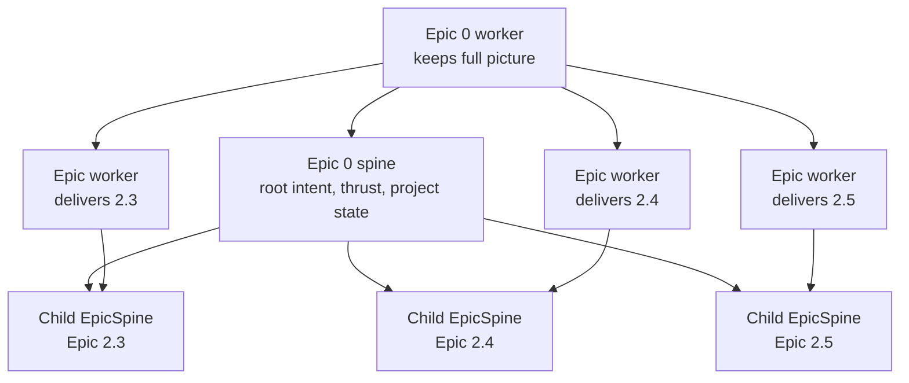
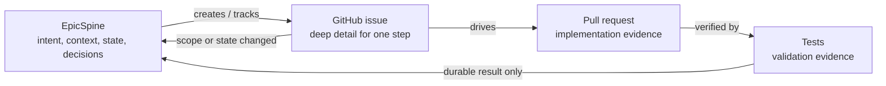
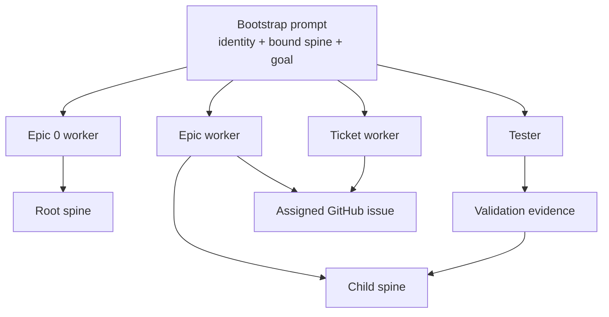
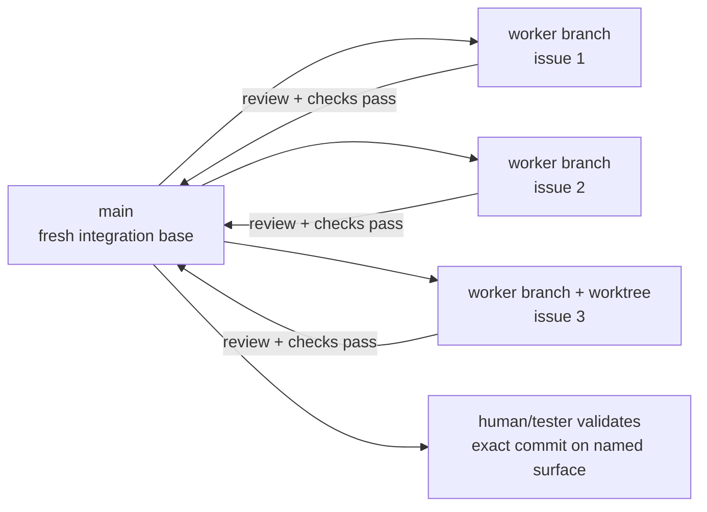

# EpicSpine

EpicSpine is a document-centered operating system for AI-assisted software delivery.

The core idea is simple: every serious body of work gets a living epic document that preserves the intent, context, current state, acceptance target, issue ledger, decisions, and handoffs. GitHub issues remain the execution board, while the spine remains authoritative for intent and coordination.

Open the deck: [index.html](index.html)

When published with GitHub Pages, the deck lives at:

https://alfablok.github.io/epicspine-skill/

## Why This Exists

AI agents are powerful, but they lose the plot easily:

- chat history disappears or becomes too long to trust;
- GitHub issues are good for local tasks but weak at holding the whole story;
- new agents arrive cold and need to reconstruct intent from scattered comments, branches, PRs, and memory;
- workers can accidentally rewrite scope, mutate the wrong document, or bury important state in chat.

EpicSpine gives agents a stable operating surface.

The spine answers:

- Why does this epic exist?
- What outcome do we want?
- How do the pieces fit together?
- What is the current state?
- Which GitHub issues are active?
- What changed that future agents must know?
- What should the next agent do?

## The Epic 0 Idea

Each project can have an **Epic 0 spine**.

Epic 0 is the root concept and barebones operating context for the project. It holds the full thrust: why the project exists, what the system is trying to become, which child epics exist, how they depend on each other, what state they are in, and where human judgment is needed.

An **Epic 0 worker** is bound to that root spine. Their job is to read the child spines, keep the whole picture coherent, spin out new child EpicSpines, and bind other agents to those child spines.



## Spine Versus GitHub Issues

The spine is the clean thread of intent, desire, context, fit, and state.

GitHub issues are the deep working surface for specific steps.

Use the spine for:

- mission and desired outcome;
- current state and next action;
- child-spine map and dependencies;
- decisions and rationale;
- issue ledger and PR links;
- validation evidence and residual risk;
- clean handoffs.

Use GitHub issues for:

- code paths and implementation notes;
- blocker investigation;
- logs, screenshots, stack traces, and command output;
- ticket-level review discussion;
- detailed validation notes.

The compression rule: if a detail helps only the current ticket worker, keep it in the issue; if it changes how future agents understand the epic, summarize it in the spine.



## Authority By Artifact

EpicSpine does not call every surface a source of truth. Each artifact has a specific authority:

| Artifact | Authoritative for |
|---|---|
| EpicSpine | Intent, scope, epic acceptance, dependencies, decisions, rollup state |
| GitHub issue | Detailed execution state for one ticket |
| Branch, PR, and code | The implementation that actually exists |
| Validation evidence | What passed or failed for an exact commit in a named environment |
| Epic 0 spine | Project direction, child-spine relationships, cross-epic health |

One active **spine steward** reconciles these surfaces. The Epic 0 worker normally stewards the root spine; the epic worker normally stewards one child spine. Ticket workers and testers write structured handoffs to their issue unless a narrow spine section is explicitly delegated.

## Role Binding

Agents are bound to identities before they act:

- **Epic 0 worker** keeps the full project picture and spins out child spines.
- **Planner** shapes scope, backlog, acceptance, and dispatch.
- **Epic worker** is the delivery lead and active steward for one child spine, managing GitHub issues, subagents, and integration inside accepted scope.
- **Ticket worker** executes one assigned GitHub issue.
- **Tester** proves pass/fail and may run bounded fix loops.
- **Reviewer / observer** reads and reports unless promoted.



Every binding names the role, bound spine, bound issue when applicable, active steward, stable assignment identity, authority, and expected handoff. This makes the work resumable when an agent stalls or is replaced.

Canonical prompt:

```text
Use $epic-spine.
Identity: Epic 0 worker
Bound spine: docs/EPIC-0-FOUNDATION-SPINE.md
Goal: keep the full project picture and state, create or update child EpicSpines, bind child workers, and loop until the project has clear next actions or needs human input.
```

## Goal-Seeking Discipline

EpicSpine agents work toward terminal states:

- an Epic 0 worker loops until the project state is coherent or human judgment is needed;
- an epic worker loops until the epic is ready for human test, tester handoff, or blocked by required input;
- a ticket worker loops until the issue is ready for testing or precisely blocked;
- a tester loops until acceptance passes, failure is evidenced, or a larger planner decision is required.

## Branch And Integration Discipline

Parallel agents need isolated execution and a fresh shared base.

- One ticket worker uses one dedicated branch by default.
- Concurrent workers use separate worktrees so each branch has isolated filesystem state; the worktree does not replace the branch.
- Every dispatch records branch, base commit, integration target, owner, and latest verified time.
- Protected `main` is the default integration and deployment base unless the spine declares another branch.
- Merge small changes after review and required checks pass, and integrate frequently.
- If work cannot merge, the issue and spine show branch, PR, blocker, owner, latest commit, and next action.
- New agents bootstrap from the freshest validated integration base, not stale long-lived branches.



The integration gates are precise:

- `review`: implementation complete, PR open, required automated checks passing;
- `testing`: the exact commit is available in a named test surface and acceptance validation is in progress;
- `done`: acceptance passed, evidence linked, residual risk recorded, and the spine reconciled.

## Human Gates And Recovery

The spine names the actions that require human approval: product or acceptance changes, production deployment, destructive migrations, credentials, irreversible external actions, and any experiential acceptance automation cannot prove.

A blocker names the decision, human owner, evidence, exact input required, and what may continue independently. `Human required` is not a complete blocker.

Every assignment records a stable identity, issue, branch, base and latest commit, last verified time, blocker, and next action. If an agent disappears, the epic worker preserves the old history, marks the assignment superseded, records the takeover identity and starting commit, and dispatches from the freshest safe base.

## Milestone 0 And Current Package

Milestone 0 for this public repo is intentionally small:

- a README that lands the concept;
- one standalone HTML deck;
- enough vocabulary to explain Epic 0, child spines, role binding, GitHub issue discipline, and goal-seeking agents.

Milestone 0 is complete. The repository now also includes the installable skill, reusable spine and issue templates, the detailed operating model, and a local structural validator.

## Skill Layout

This repo includes the installable Codex skill under `skill/epic-spine/`:

```text
skill/
  epic-spine/
    SKILL.md
    agents/openai.yaml
    assets/
      epic-spine-template.md
      github-issue-template.md
    references/
      operating-model.md
    scripts/
      validate_spine.py
```

To use it manually in an existing Codex session:

```text
Use $epic-spine from ./skill/epic-spine.
Re-read SKILL.md before continuing.
Identity: Epic 0 worker
Bound spine: <path to root spine>
```

Validate a project spine after creating or materially restructuring it:

```sh
python3 skill/epic-spine/scripts/validate_spine.py --strict path/to/EPIC.md
```

The validator checks local document structure and recorded evidence. It does not claim to verify remote GitHub state.
